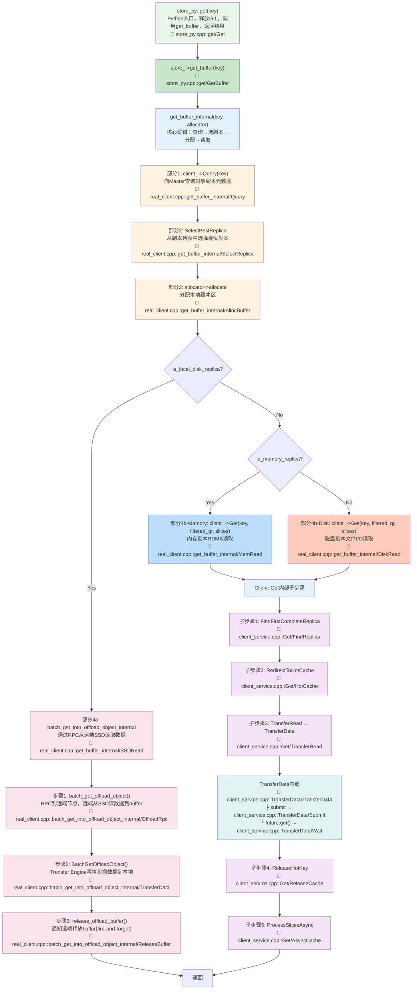
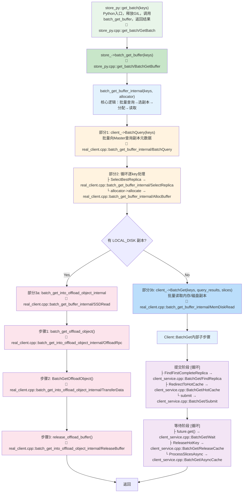

## 打点流程图

### `get` 流程

```mermaid
flowchart TB
    Start["store_py::get(key)<br/>Python入口，释放GIL，调用get_buffer，返回结果<br/>🔑 store_py.cpp::get/Get"] --> GetBufferCall["store_->get_buffer(key)<br/>🔑 store_py.cpp::get/GetBuffer"]

    GetBufferCall --> Internal["get_buffer_internal(key, allocator)<br/>核心逻辑：查询→选副本→分配→读取<br/>"]

    Internal --> QueryPart["部分1: client_->Query(key)<br/>向Master查询对象副本元数据<br/>🔑 real_client.cpp::get_buffer_internal/Query"]
    QueryPart --> SelectPart["部分2: SelectBestReplica<br/>从副本列表中选择最优副本<br/>🔑 real_client.cpp::get_buffer_internal/SelectReplica"]
    SelectPart --> AllocPart["部分3: allocator->allocate<br/>分配本地缓冲区<br/>🔑 real_client.cpp::get_buffer_internal/AllocBuffer"]

    AllocPart --> CheckDisk{is_local_disk_replica?}

    CheckDisk -->|Yes| SSDPart["部分4a: batch_get_into_offload_object_internal<br/>通过RPC从远端SSD读取数据<br/>🔑 real_client.cpp::get_buffer_internal/SSDRead"]
    SSDPart --> SSDRpc["步骤1: batch_get_offload_object()<br/>RPC到远端节点，远端从SSD读数据到buffer<br/>🔑 real_client.cpp::batch_get_into_offload_object_internal/OffloadRpc"]
    SSDRpc --> SSDTransfer["步骤2: BatchGetOffloadObject()<br/>Transfer Engine零拷贝搬数据到本地<br/>🔑 real_client.cpp::batch_get_into_offload_object_internal/TransferData"]
    SSDTransfer --> SSDRelease["步骤3: release_offload_buffer()<br/>通知远端释放buffer(fire-and-forget)<br/>🔑 real_client.cpp::batch_get_into_offload_object_internal/ReleaseBuffer"]
    SSDRelease --> Done["返回"]

    CheckDisk -->|No| ReadType{is_memory_replica?}

    ReadType -->|Yes| MemRead["部分4b-Memory: client_->Get(key, filtered_qr, slices)<br/>内存副本RDMA读取<br/>🔑 real_client.cpp::get_buffer_internal/MemRead"]
    ReadType -->|No| DiskRead["部分4b-Disk: client_->Get(key, filtered_qr, slices)<br/>磁盘副本文件I/O读取<br/>🔑 real_client.cpp::get_buffer_internal/DiskRead"]

    MemRead --> ClientGetSub["Client::Get内部子步骤<br/>"]
    DiskRead --> ClientGetSub

    ClientGetSub --> FindReplica["子步骤1: FindFirstCompleteReplica<br/>🔑 client_service.cpp::Get/FindReplica"]
    FindReplica --> HotCache["子步骤2: RedirectToHotCache<br/>🔑 client_service.cpp::Get/HotCache"]
    HotCache --> TransferRead["子步骤3: TransferRead → TransferData<br/>🔑 client_service.cpp::Get/TransferRead"]
    TransferRead --> TransferDetail["TransferData内部<br/>🔑 client_service.cpp::TransferData/TransferData<br/>├ submit → client_service.cpp::TransferData/Submit<br/>└ future.get() → client_service.cpp::TransferData/Wait"]
    TransferDetail --> ReleaseCache["子步骤4: ReleaseHotKey<br/>🔑 client_service.cpp::Get/ReleaseCache"]
    ReleaseCache --> AsyncUpdate["子步骤5: ProcessSlicesAsync<br/>🔑 client_service.cpp::Get/AsyncCache"]
    AsyncUpdate --> Done

    style Start fill:#e8f5e9
    style GetBufferCall fill:#c8e6c9
    style Internal fill:#e3f2fd
    style QueryPart fill:#fff3e0
    style SelectPart fill:#fff3e0
    style AllocPart fill:#fff3e0
    style SSDPart fill:#fce4ec
    style SSDRpc fill:#fce4ec
    style SSDTransfer fill:#fce4ec
    style SSDRelease fill:#fce4ec
    style MemRead fill:#bbdefb
    style DiskRead fill:#ffccbc
    style ClientGetSub fill:#e3f2fd
    style FindReplica fill:#f3e5f5
    style HotCache fill:#f3e5f5
    style TransferRead fill:#f3e5f5
    style TransferDetail fill:#e0f2f1
    style ReleaseCache fill:#f3e5f5
    style AsyncUpdate fill:#f3e5f5
```

### `get_batch` 流程

```mermaid
flowchart TB
    Start["store_py::get_batch(keys)<br/>Python入口，释放GIL，调用batch_get_buffer，返回结果<br/>🔑 store_py.cpp::get_batch/GetBatch"] --> BatchGetBufferCall["store_->batch_get_buffer(keys)<br/>🔑 store_py.cpp::get_batch/BatchGetBuffer"]

    BatchGetBufferCall --> Internal["batch_get_buffer_internal(keys, allocator)<br/>核心逻辑：批量查询→选副本→分配→读取<br/>"]

    Internal --> QueryPart["部分1: client_->BatchQuery(keys)<br/>批量向Master查询副本元数据<br/>🔑 real_client.cpp::batch_get_buffer_internal/BatchQuery"]
    QueryPart --> LoopPart["部分2: 循环逐key处理<br/>├ SelectBestReplica → real_client.cpp::batch_get_buffer_internal/SelectReplica<br/>└ allocator->allocate → real_client.cpp::batch_get_buffer_internal/AllocBuffer"]

    LoopPart --> CheckDisk{有 LOCAL_DISK 副本?}

    CheckDisk -->|Yes| SSDPart["部分3a: batch_get_into_offload_object_internal<br/>🔑 real_client.cpp::batch_get_buffer_internal/SSDRead"]
    SSDPart --> SSDRpc["步骤1: batch_get_offload_object()<br/>🔑 real_client.cpp::batch_get_into_offload_object_internal/OffloadRpc"]
    SSDRpc --> SSDTransfer["步骤2: BatchGetOffloadObject()<br/>🔑 real_client.cpp::batch_get_into_offload_object_internal/TransferData"]
    SSDTransfer --> SSDRelease["步骤3: release_offload_buffer()<br/>🔑 real_client.cpp::batch_get_into_offload_object_internal/ReleaseBuffer"]

    CheckDisk -->|No| MemDiskRead["部分3b: client_->BatchGet(keys, query_results, slices)<br/>批量读取内存/磁盘副本<br/>🔑 real_client.cpp::batch_get_buffer_internal/MemDiskRead"]

    MemDiskRead --> BatchGetSub["Client::BatchGet内部子步骤<br/>"]

    BatchGetSub --> SubmitLoop["提交阶段 [循环]<br/>├ FindFirstCompleteReplica → client_service.cpp::BatchGet/FindReplica<br/>├ RedirectToHotCache → client_service.cpp::BatchGet/HotCache<br/>└ submit → client_service.cpp::BatchGet/Submit"]
    SubmitLoop --> WaitLoop["等待阶段 [循环]<br/>├ future.get() → client_service.cpp::BatchGet/Wait<br/>├ ReleaseHotKey → client_service.cpp::BatchGet/ReleaseCache<br/>└ ProcessSlicesAsync → client_service.cpp::BatchGet/AsyncCache"]

    SSDRelease --> Done["返回"]
    WaitLoop --> Done

    style Start fill:#e8f5e9
    style BatchGetBufferCall fill:#c8e6c9
    style Internal fill:#e3f2fd
    style QueryPart fill:#fff3e0
    style LoopPart fill:#fff3e0
    style SSDPart fill:#fce4ec
    style SSDRpc fill:#fce4ec
    style SSDTransfer fill:#fce4ec
    style SSDRelease fill:#fce4ec
    style MemDiskRead fill:#bbdefb
    style BatchGetSub fill:#e3f2fd
    style SubmitLoop fill:#f3e5f5
    style WaitLoop fill:#f3e5f5
```

### `put` 流程

```mermaid
flowchart TB
    Start["store_py::put(key, value)<br/>Python入口，释放GIL，调用store_->put()<br/>🔑 store_py.cpp::put/Put"] --> PutCall["store_->put(key, value, config)<br/>🔑 store_py.cpp::put/PutBuffer"]

    PutCall --> Internal["put_internal(key, value, config, allocator)<br/>核心逻辑：分配→拷贝→切分→写入<br/>"]

    Internal --> AllocPart["部分1: allocator->allocate<br/>分配本地缓冲区(RDMA注册内存)<br/>🔑 real_client.cpp::put_internal/AllocBuffer"]
    AllocPart --> CopyPart["部分2: memcpy<br/>将用户数据拷贝到分配的缓冲区<br/>🔑 real_client.cpp::put_internal/MemCopy"]
    CopyPart --> SplitPart["部分3: split_into_slices<br/>按kMaxSliceSize切分为多个Slice<br/>🔑 real_client.cpp::put_internal/SplitSlices"]
    SplitPart --> ClientPutPart["部分4: client_->Put(key, slices, config)<br/>🔑 client_service.cpp::Put/TransferPut"]

    ClientPutPart --> PutStart["子步骤1: master_client_.PutStart(key)<br/>向Master申请分配replica handle<br/>若返回OBJECT_ALREADY_EXISTS则直接返回成功<br/>🔑 client_service.cpp::Put/PutStart"]

    PutStart --> CheckDisk{storage_backend_存在<br/>且有磁盘副本?}

    CheckDisk -->|Yes| DiskWrite["子步骤2a: PutToLocalFile(key, slices, disk_descriptor)<br/>将数据写入本地磁盘(仅处理一个磁盘副本)<br/>🔑 client_service.cpp::Put/DiskWrite"]

    CheckDisk -->|No| MemReplicaLoop["子步骤2b: 遍历所有内存副本<br/>对每个内存副本调用TransferWrite"]

    DiskWrite --> MemReplicaLoop

    MemReplicaLoop --> TransferWrite["TransferWrite → TransferData(replica, slices, WRITE)<br/>🔑 client_service.cpp::Put/TransferWrite"]

    TransferWrite --> TransferDetail["TransferData内部<br/>🔑 client_service.cpp::TransferData/TransferData<br/>├ transfer_submitter_->submit() → client_service.cpp::TransferData/Submit<br/>└ future->get() 阻塞等待传输完成 → client_service.cpp::TransferData/Wait"]

    TransferDetail --> CheckTransfer{传输是否成功?}

    CheckTransfer -->|失败| PutRevoke["子步骤3a: master_client_.PutRevoke(key, MEMORY)<br/>撤销本次Put操作，释放已分配的replica<br/>🔑 client_service.cpp::Put/PutRevoke"]

    CheckTransfer -->|成功| PutEnd["子步骤3b: master_client_.PutEnd(key, MEMORY)<br/>确认Put完成，replica正式生效<br/>🔑 client_service.cpp::Put/PutEnd"]

    PutRevoke --> Done["返回"]
    PutEnd --> Done

    style Start fill:#e8f5e9
    style PutCall fill:#c8e6c9
    style Internal fill:#e3f2fd
    style AllocPart fill:#fff3e0
    style CopyPart fill:#fff3e0
    style SplitPart fill:#fff3e0
    style ClientPutPart fill:#bbdefb
    style PutStart fill:#f3e5f5
    style DiskWrite fill:#fce4ec
    style MemReplicaLoop fill:#f3e5f5
    style TransferWrite fill:#f3e5f5
    style TransferDetail fill:#e0f2f1
    style PutRevoke fill:#ffcdd2
    style PutEnd fill:#c8e6c9
```

### `put_batch` 流程

```mermaid
flowchart TB
    Start["store_py::put_batch(keys, values)<br/>Python入口，释放GIL，调用store_->put_batch()<br/>🔑 store_py.cpp::put_batch/PutBatch"] --> PutBatchCall["store_->put_batch(keys, values, config)<br/>🔑 store_py.cpp::put_batch/BatchPutBuffer"]

    PutBatchCall --> Internal["put_batch_internal(keys, values, config, allocator)<br/>核心逻辑：逐key分配→拷贝→切分→批量写入<br/>"]

    Internal --> LoopPart["部分1: 循环逐key处理<br/>对每个key执行以下3步:<br/>├ allocator->allocate → 🔑 real_client.cpp::put_batch_internal/AllocBuffer<br/>│  (分配本地缓冲区，RDMA注册内存)<br/>├ memcpy → 🔑 real_client.cpp::put_batch_internal/MemCopy<br/>│  (将用户数据拷贝到分配的缓冲区)<br/>└ split_into_slices → 🔑 real_client.cpp::put_batch_internal/SplitSlices<br/>   (按kMaxSliceSize切分为多个Slice)"]

    LoopPart --> BatchPutPart["部分2: client_->BatchPut(keys, batched_slices, config)<br/>🔑 client_service.cpp::BatchPut/TransferBatchPut"]

    BatchPutPart --> CreateOps["子步骤1: CreatePutOperations(keys, batched_slices)<br/>为每个key创建PutOperation对象，包含key和对应的slices<br/>🔑 client_service.cpp::BatchPut/CreateOps"]

    CreateOps --> StartBatch["子步骤2: StartBatchPut(ops, config)<br/>调用master_client_.BatchPutStart(keys, slice_lengths, config)<br/>Master为每个key分配replica handle，返回到op.replicas中<br/>分配失败的op标记错误，后续步骤跳过<br/>🔑 client_service.cpp::StartBatchPut/PutStart"]

    StartBatch --> SubmitPhase["子步骤3: SubmitTransfers(ops)<br/>对每个未失败的op，逐个提交传输任务:<br/>├ 若storage_backend_存在且有磁盘副本:<br/>│  调用PutToLocalFile写入本地磁盘 → 🔑 client_service.cpp::SubmitTransfers/DiskWrite<br/>├ 遍历op中所有内存副本:<br/>│  调用transfer_submitter_->submit(replica, slices, WRITE)<br/>│  返回TransferFuture存入op.pending_transfers → 🔑 client_service.cpp::SubmitTransfers/Submit<br/>└ 若任一replica提交失败，标记op错误，清空pending_transfers"]

    SubmitPhase --> WaitPhase["子步骤4: WaitForTransfers(ops)<br/>对每个有pending_transfers的op:<br/>├ 遍历所有TransferFuture，调用future.get()阻塞等待传输完成 → 🔑 client_service.cpp::WaitForTransfers/Wait<br/>└ 若任一传输失败，记录首个错误，标记op失败"]

    WaitPhase --> Finalize["子步骤5: FinalizeBatchPut(ops)<br/>根据每个op的结果分类处理:<br/>├ 传输成功的op: 调用master_client_.BatchPutEnd(keys) → 🔑 client_service.cpp::FinalizeBatchPut/PutEnd<br/>│  确认Put完成，replica正式生效，标记op成功<br/>├ 传输失败但已分配replica的op: 调用master_client_.BatchPutRevoke(keys) → 🔑 client_service.cpp::FinalizeBatchPut/PutRevoke<br/>│  撤销Put操作，释放已分配的replica<br/>└ 未分配replica的op(早期失败): 无需清理"]

    Finalize --> CollectResults["子步骤6: CollectResults(ops)<br/>从每个PutOperation中收集结果<br/>OBJECT_ALREADY_EXISTS视为成功<br/>🔑 client_service.cpp::BatchPut/CollectResults"]

    CollectResults --> Done["返回"]

    style Start fill:#e8f5e9
    style PutBatchCall fill:#c8e6c9
    style Internal fill:#e3f2fd
    style LoopPart fill:#fff3e0
    style BatchPutPart fill:#bbdefb
    style CreateOps fill:#f3e5f5
    style StartBatch fill:#f3e5f5
    style SubmitPhase fill:#f3e5f5
    style WaitPhase fill:#f3e5f5
    style Finalize fill:#f3e5f5
    style CollectResults fill:#f3e5f5
```